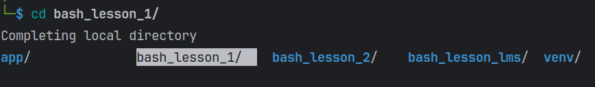
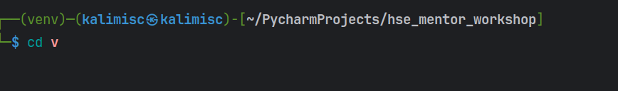
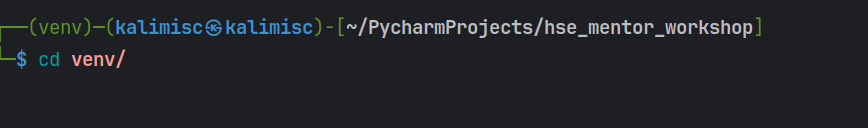

### после написании команды cd нажимаем на tab
### tab покажет все возможные директории для перехода

### также можем написать cd и часть названия директории

### затем нажать tab и произойдет дополнение
